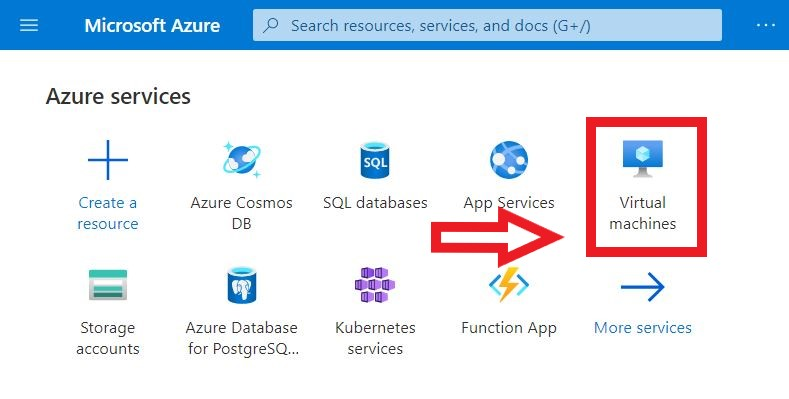
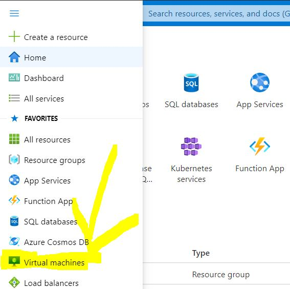
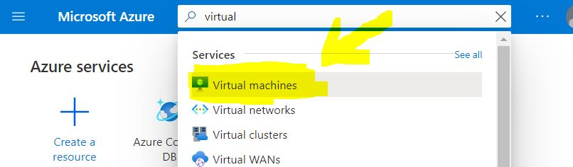
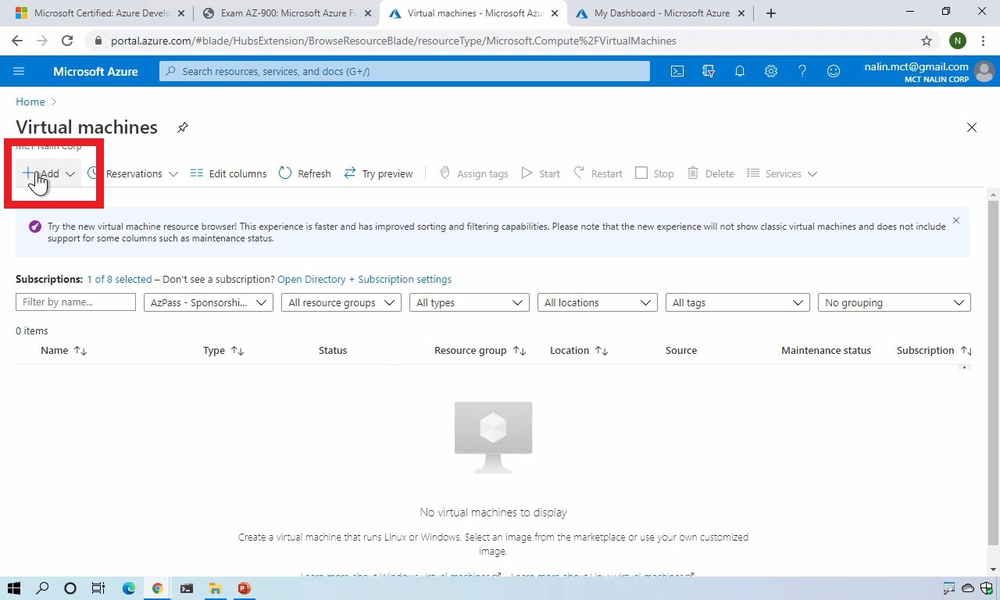
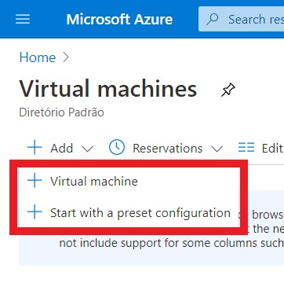
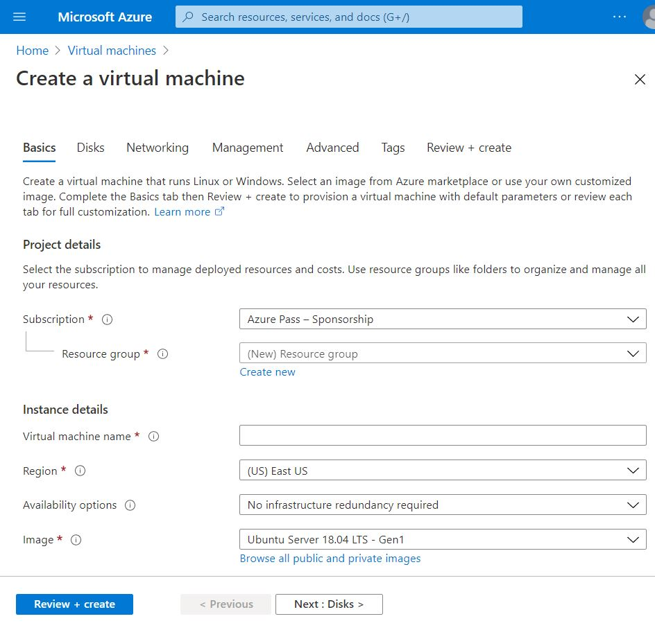
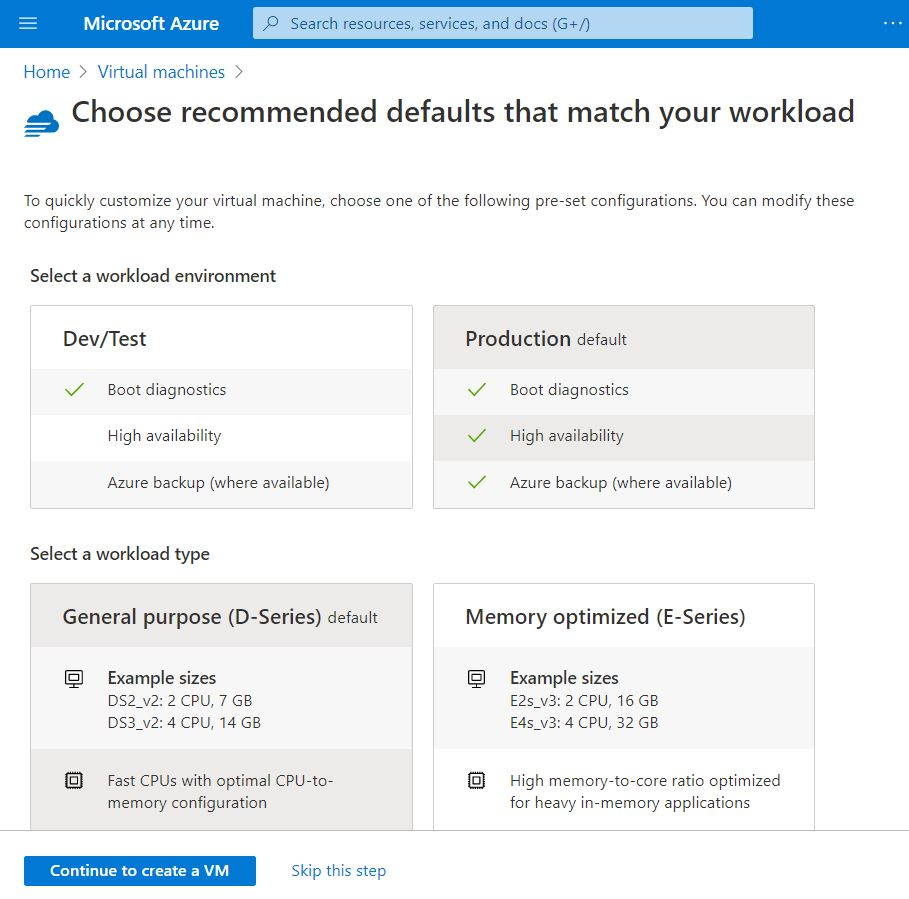
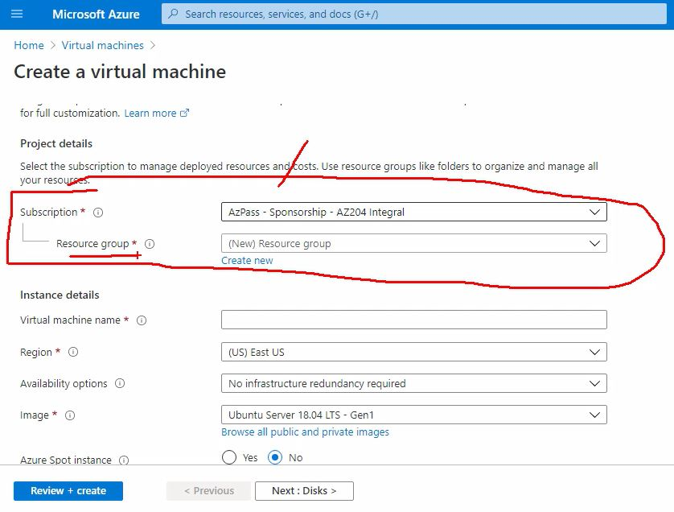

# Creating VM on Azure Cloud

## Learning about Virtual Machines(VM)
[Read More](../../virtual_machine/README.md)

## Finding the VM Service
- Acessing the [Azure Portal](https://portal.azure.com/?l=en.pt-br#home)
- Select the **Virtual Machine** (called **Azure Service**)
  - In the home page

  

  - On the left menu 

  

  - Or in the Search Box

  

## Creating the VM
- In the Virtual Machine Page, select the **+ Add** option

  

- Select One f the options: **Virtual Machine** or **Start with a preset configuration**

  

  - The first option, **+Virtual Machine**, will create a VM from scratch.

  

  - The second option, **+Start with a preset configuration**, will be based on a template available in the Azure Cloud 
  
  

### Creates a VM from Scratch
- First, you have to create or choose a [Resource Group](https://docs.microsoft.com/pt-br/azure/azure-resource-manager/management/manage-resource-groups-portal#what-is-a-resource-group) that will contain the resource
  - *A resource group is a container that holds related resources for an Azure solution*

  

  - **Create new** resource group called "**AZ204_Ambiente**"
  - **Virtual machine name** as **AZ204AmbienteVM**
  - **Region**: **(US) East US**
    - *When you choose a Region you have to consider latency and costs*
  - [Availability Options](https://docs.microsoft.com/en-us/azure/virtual-machines/manage-availability)
    - https://livebook.manning.com/book/learn-azure-in-a-month-of-lunches-second-edition/chapter-7/21
    - *No infrastructure redundancy required* (No redundancy) **(Choose this one)**
    - *Availability zone* - Lets you distribute VMs across physically isolated segments of an Azure region to further maximize your application redundancy
    - *Availability set* - Lets you logically group VMs to distribute them across a single Azure data center and minimize disruption from outages or maintenance updates.

VM Name
AZ204_AmbienteVM

VM Resource Group
AZ204_AmbienteRG
